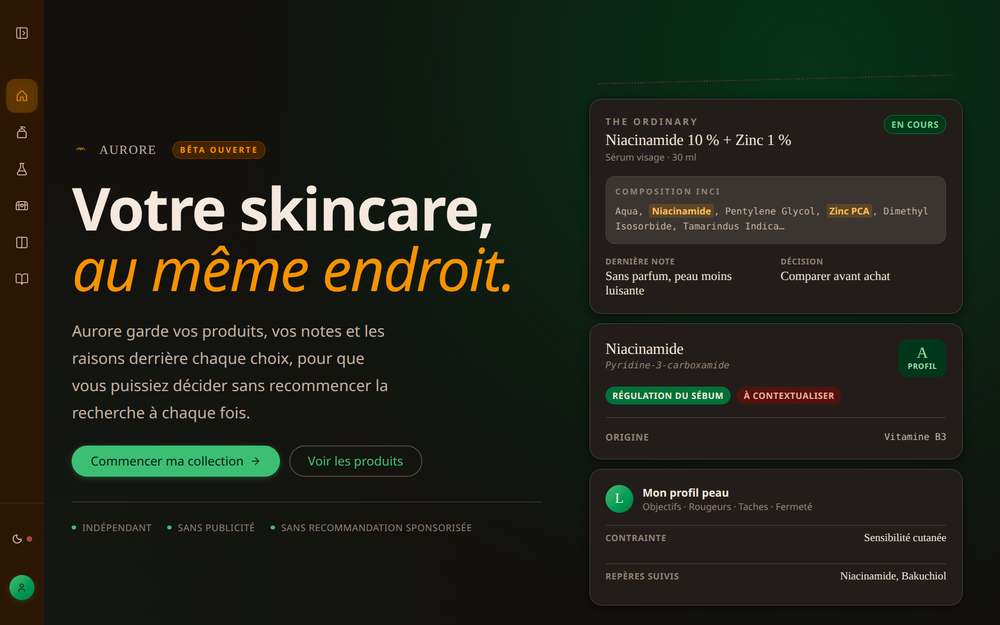
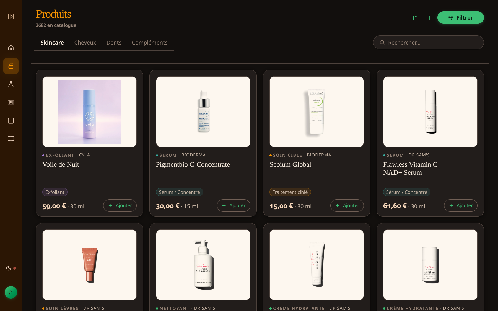
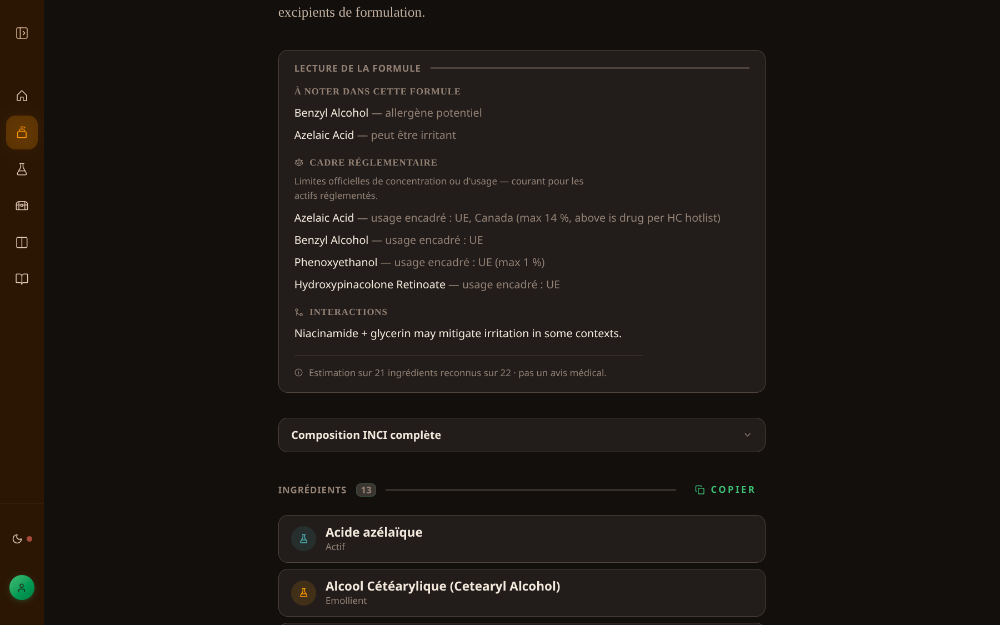
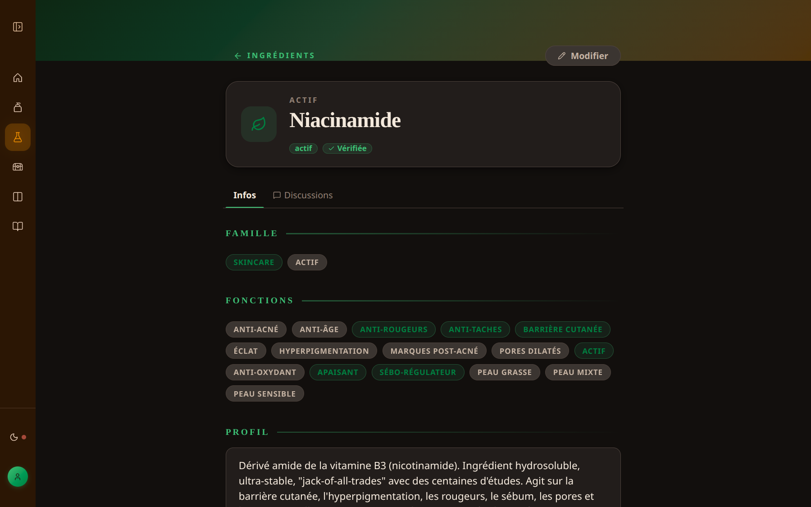

# Aurore — Skincare Research Memory

Aurore is a skincare research app I built because I was tired of my own messy workflow.

Before this, I was switching between brand websites, copying INCI lists into spreadsheets, asking an AI for an opinion, and then losing the reasoning a few days later in random Markdown notes.

Aurore is my way to keep everything in one place: products, ingredients, notes, decisions, and the reason why a product is still interesting — or why I decided to avoid it.

It is not a medical tool.
It does not try to tell people what to buy.
It is just a calmer way to research skincare products.

**[Live demo → aurore-app.fr](https://aurore-app.fr)** — open beta.



---

## What Aurore does

Aurore helps people save and compare skincare products before buying them.

It lets users:

- save products in a personal database;
- parse INCI ingredient lists;
- keep notes beside each product;
- mark products as wishlist, current candidate, holy grail, or avoided;
- compare formulas without pretending there is one perfect score;
- come back later and remember why they made a decision.

The main idea is simple: skincare research takes time, so the reasoning should not disappear.

---

## Why I built it

I built Aurore because I often ended up doing the same research twice.

I would find a product, check the ingredients, compare it with other products, ask questions, take notes, and then forget where I saved everything.

Aurore keeps that research trail next to the product itself.

The goal is not to replace personal judgment.
The goal is to make the research process easier to follow.

---

## What Aurore is

Aurore is a calm skincare shelf and formula notebook.

It is made for people who:

- read INCI lists;
- compare formulas;
- hesitate before buying;
- want to remember why they liked or rejected a product;
- use AI or online research, but still want to keep their own notes.

The basic loop is:

```text
collect products → read formulas → compare options
→ decide → keep the reasoning → come back later
```

Products can have different decision states:

- `Wishlist`
- `En cours`
- `Saint Graal`
- `À éviter`

`À éviter` is not just a trash state. It keeps the reason why a product was rejected, so the same research does not have to be repeated later.

---

## What Aurore is not

Aurore is not:

- a medical tool;
- a diagnostic system;
- a dermatology app;
- a universal product recommendation engine;
- a Yuka-style safety score;
- a shopping app;
- an influencer platform.

It is a personal research and memory tool.

---

## Core features

### Products and ingredients

- Personal database of cosmetic products.
- INCI lists parsed into structured ingredients.
- Ingredient roles, families and notes.
- Tags for filtering products.
- Personal notes on each product.
- Decision state for each product.
- Product comparison without fake precision.

### Research memory

- Wishlist, current candidate, holy-grail and avoided states.
- Rejection reasons are kept instead of being lost.
- Product pages show the formula, notes, decision state and assessment.
- The app is designed to help users continue their research later.

### Auth and data boundaries

- Email and password authentication with Argon2 via Bun.
- Google OAuth.
- Short-lived access token.
- Refresh token rotation in an HttpOnly cookie.
- PostgreSQL Row-Level Security for user-owned data.

See [`docs/SECURITY.md`](./docs/SECURITY.md) for more details.

---

## Formula assessment

Aurore computes a formula assessment on the backend from the INCI list.

The assessment looks at:

- possible risks;
- possible benefits;
- confidence level.

It is not a diagnosis.
It is not a medical recommendation.
It is not a universal safety score.

The point is to help users read formulas more calmly and compare products with more context.

The assessment logic lives in a separate MIT library called `algo-derm`.

In this repo, the library is included as a backend tarball under `vendor/`. This means the app can be built and run without access to a private registry.

The frontend only receives the final `ProductAssessment`. The ingredient dataset is not shipped to the browser.

See [`docs/scoring.md`](./docs/scoring.md) for:

- the input and output contract;
- the confidence model;
- the limits of the assessment;
- examples;
- known caveats.

---

## Screenshots

|                                        Catalogue                                         |                                             Formula reading                                              |                                         Ingredient reference                                          |
| :--------------------------------------------------------------------------------------: | :------------------------------------------------------------------------------------------------------: | :---------------------------------------------------------------------------------------------------: |
| [](./docs/screenshots/02-catalogue.png) | [](./docs/screenshots/03-product-detail.png) | [](./docs/screenshots/04-ingredient.png) |

---

## Technical overview

Aurore is a full-stack TypeScript monorepo.

The app uses:

- React 19 on the frontend;
- TanStack Router and TanStack Query;
- Hono for the backend API;
- shared Zod schemas between frontend and backend;
- PostgreSQL 18 with Drizzle;
- Row-Level Security for user data;
- Docker Compose for development and production;
- Vitest and Playwright for tests;
- Nginx and SSL in production.

---

## Architecture

```text
React 19 + TanStack Router/Query
        │
        │ shared Zod schemas
        ▼
Hono API / RPC
        │
        ├── Auth: Argon2, JWT, Google OAuth
        ├── Formula assessment: algo-derm
        └── Product services
        │
        ▼
PostgreSQL 18 + Drizzle + RLS
```

Repository structure:

```text
aurore/
├── backend/            # Hono API: routes, services, database access
├── frontend/           # React app with Vite and TanStack
├── shared/             # Shared Zod schemas
├── vendor/             # Vendored dependencies, including algo-derm
├── infra/              # Docker, Nginx and ops config
├── backups/            # Database backup workflow
├── scripts/            # Automation scripts and just recipes
└── docs/               # Project documentation
```

---

## Stack

| Layer          | Technology                                |
| :------------- | :---------------------------------------- |
| Runtime        | Bun                                       |
| Backend        | Hono, REST API, typesafe RPC              |
| Frontend       | React 19, TanStack Router, TanStack Query |
| Database       | PostgreSQL 18, Drizzle ORM                |
| Validation     | Zod                                       |
| Styling        | Vanilla CSS, Lucide Icons                 |
| Quality        | Biome, Vitest, Playwright, Lefthook       |
| Infrastructure | Docker Compose, Nginx                     |

---

## Quick start

> `just dev` runs a TypeScript preflight on the host before Docker starts.
> In development, containers run TypeScript source directly.

```bash
# First-time setup
just init

# Fill in secrets
$EDITOR .env.dev

# Start the development environment
just dev-fresh
```

Daily workflow:

```bash
# TypeScript watch mode
just ts-check

# Docker development stack
just dev
```

See [`docs/DEVELOPMENT.md`](./docs/DEVELOPMENT.md) for setup, commands, tests, database workflows and troubleshooting.

---

## Running without Docker or just

Some parts of the project can run with Bun alone.

This is useful for quick checks, but it does not start the full backend, database, migrations or E2E environment.

```bash
bun install

# Shared Zod contracts
(cd shared && bun run build && bun test)

# Frontend unit tests
(cd frontend && bun run test:run)

# Lint and format
bunx biome check .
```

The full stack requires Docker.

---

## Documentation

### Engineering

- [`docs/DEVELOPMENT.md`](./docs/DEVELOPMENT.md) — setup, commands, tests and troubleshooting.
- [`docs/TESTING.md`](./docs/TESTING.md) — backend, frontend and E2E test commands.
- [`docs/scoring.md`](./docs/scoring.md) — formula assessment contract, confidence model and limits.
- [`docs/conventions/`](./docs/conventions/) — backend tests, dates, error handling and project conventions.

### Architecture decisions

- [`docs/adr/`](./docs/adr/) — architecture decision records.

The ADRs document the main decisions behind the project, especially around auth, database access, RLS, formula assessment, deployment and testing.

### Policy

- [`docs/SECURITY.md`](./docs/SECURITY.md) — auth model, RLS and database role separation.
- [`docs/PRIVACY.md`](./docs/PRIVACY.md) — RGPD policy and data handling.

---

## Limitations

Aurore has clear limits:

- It is not dermatological advice.
- It is not a diagnostic system.
- Formula assessment depends on ingredient coverage.
- Unknown ingredients lower the confidence level.
- A low-confidence assessment should not be treated as a strong signal.
- Assessment is currently per product.
- Routine-level interactions are not modelled yet.
- The project is maintained by one developer.
- `algo-derm` is still pre-1.0, so its calibration can change.
- The app is currently tested at personal/open-beta scale.

---

## Project status

Aurore is an open beta and a solo project.

The current focus is:

- making the formula assessment easier to understand;
- improving product comparison;
- adding more edge-case tests;
- keeping the project easy to run;
- keeping the code and documentation readable for technical reviewers.
